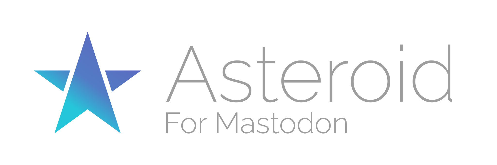
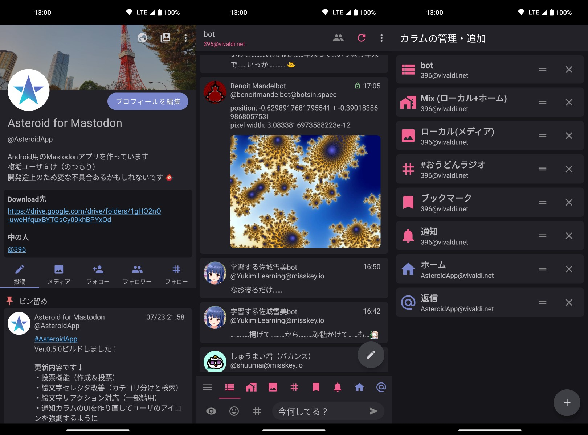

# Asteroid for Mastodon
Android上で動作する非公式Mastodonクライアントです

---
## 独自機能

+ 表示カラムのカスタマイズ
+ Mixタイムライン(ホーム+LTLの統合)
+ 別のアカウントからふぁぼ・BT・ブックマーク
+ フォロワー数やふぁぼ数などの非表示
+ 実況モード

---
## Downloads

[Releases](https://github.com/g396/asteroid/releases)の最新版のAssetsに含まれるapkファイルをDLしてインストールして下さい

---
## 問い合わせ

Asteroid: [AsteroidApp@vivaldi.net](https://social.vivaldi.net/@AsteroidApp)
Developer: [396@vivaldi.net](https://social.vivaldi.net/@396)
